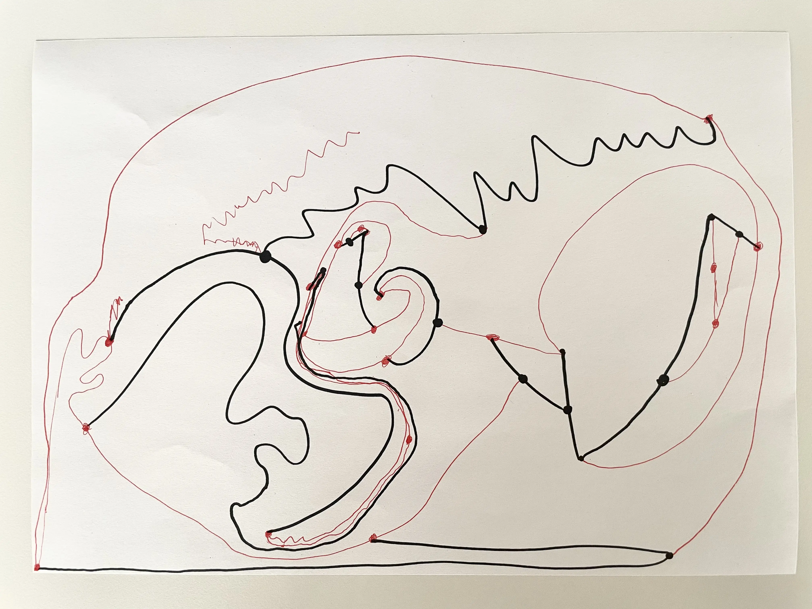
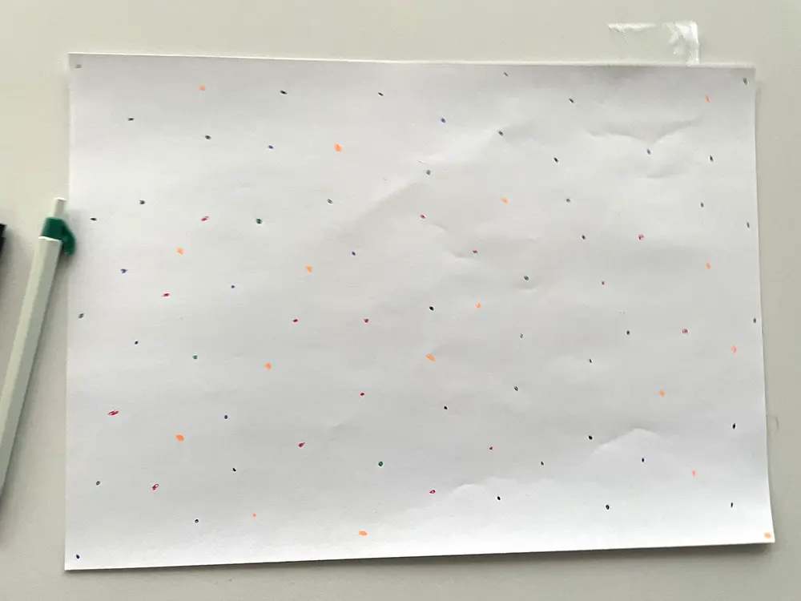
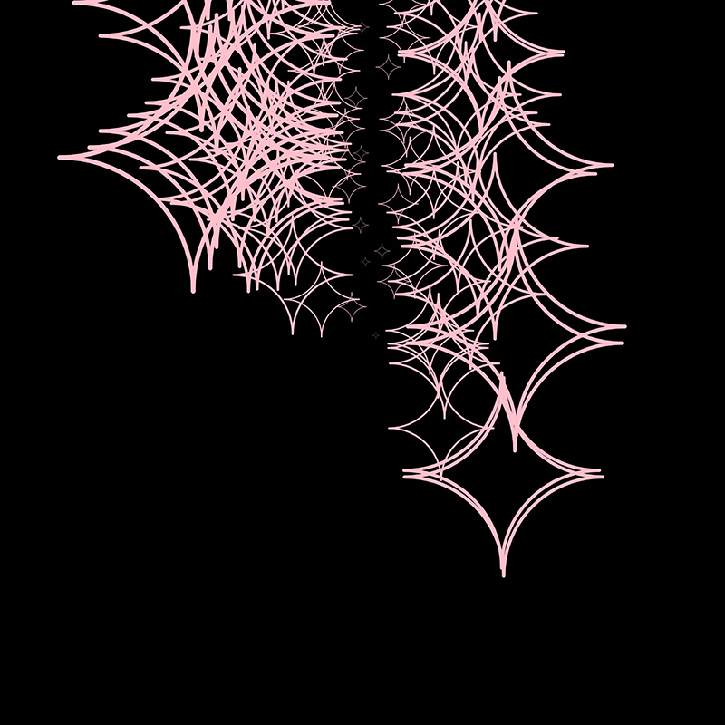
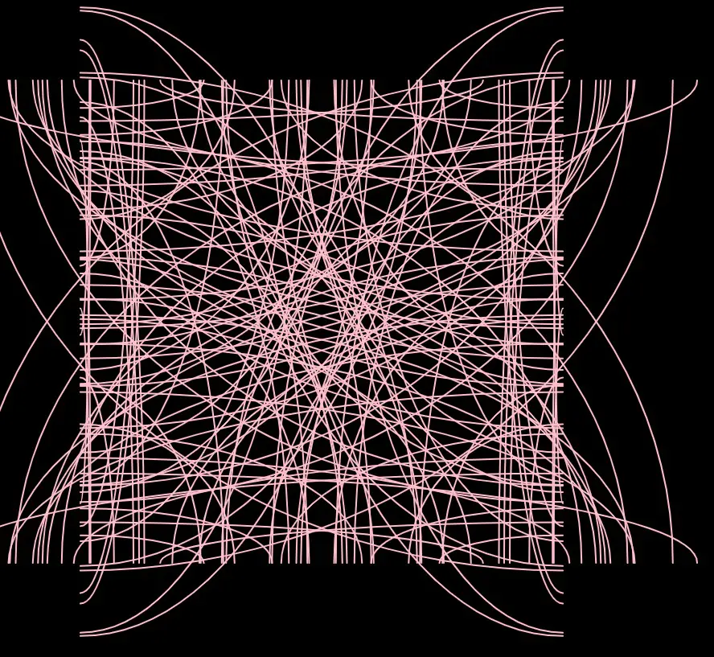

# Day 01

## Computing without computer

### Solid Paper Experiment

We began experimenting in a group with some pens and paper. First, Robin and I played Sprouts. We added an extra rule, allowing players to reuse free points from the old sprout on the paper, creating a huge abstract drawing that looked like a head:

 

In the group, we played "The Beach" for 30 minutes, and this was the result:

 

*A colorful dot paper*

## Computing with computer

### Draw, then Code

<iframe src="https://editor.p5js.org/PerlaH/full/y8b-ywLwn" width="100%" height="450" frameborder="no"></iframe>

## Computing with computer

To interact with my final artwork, you have to click on it. If you think there are enough stars, press the "n" key, and to save a picture, press "s."


<iframe src="https://editor.p5js.org/PerlaH/full/y8b-ywLwn" width="100%" height="450" frameborder="no"></iframe>


## End Feelings of the Day:

Satisfaction! I had a lot of fun, and I look forward to my project, even if I don't know exactly what I am going to do.
