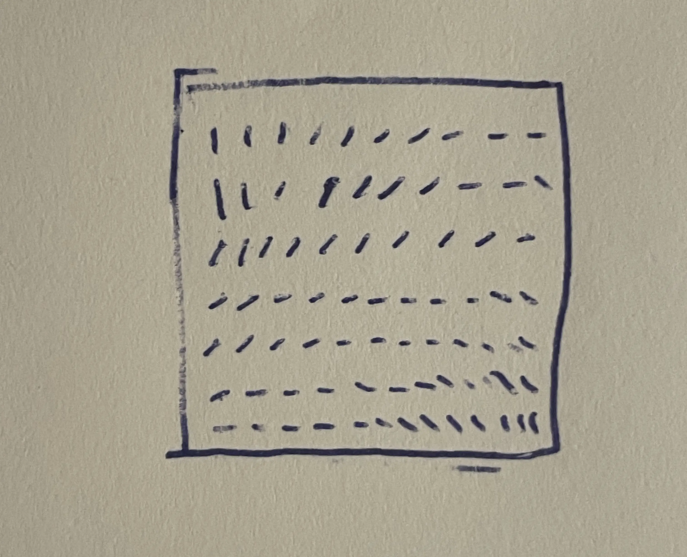
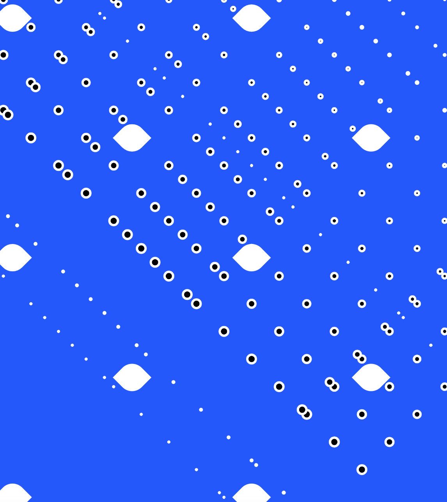
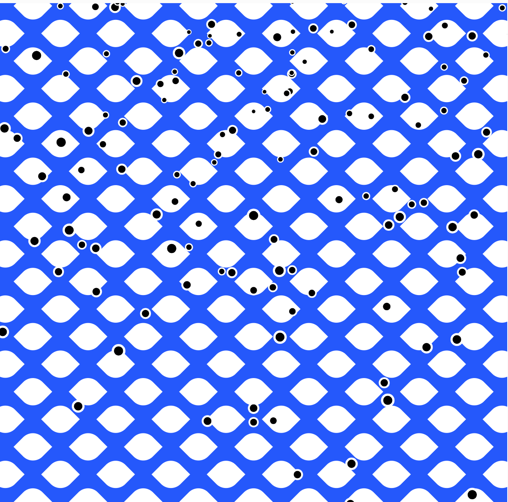
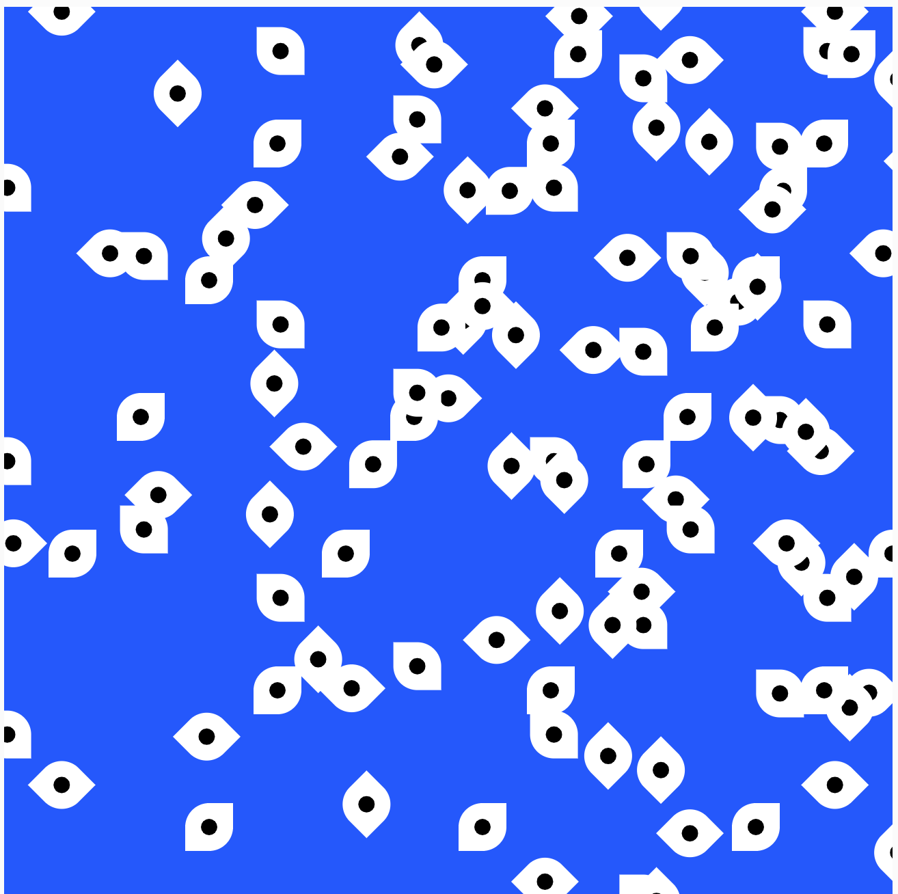
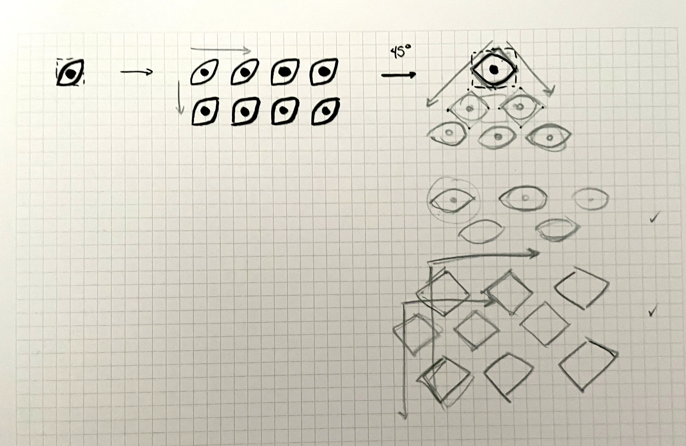

# Day 02

## Iterative Patterns

I started by creating lines, but somehow my idea shifted to eyes.

 

I experimented a lot but encountered problems with the rotation.

Here are some nice failures:





### A variation as a GIF:


I created a grid for the "ojo" function, which was challenging to make fill the entire canvas.  

```js
// Javascript code with syntax highlighting.
for (var x = 50; x < width*1.5; x += 50) {
    for (var y = 50; y < height*1.5; y += 50) {
      ojo(x, y);
    }
  }
```

The eye consists of a rotated rectangle with rounded corners and a circular pupil. I used 'frameCount' and 'sin' to smoothly increase and decrease its size harmoniously. 

```js
// Javascript code with syntax highlighting.
function ojo(_x, _y) {
  push();

  translate(width / 2, -400);
  rotate(45);

  const t = (sin(frameCount * 3) + 1) * 0.5 * 55;
  const g = (-sin(frameCount * 3) + 1) * 0.5 * 50;

  fill(255);
  rect(_x, _y, g, g, 100, 0, 100, 0);

  fill("#1F51FF");
  circle(_x, _y, t);

  pop();
}
```

### The end result:


<iframe src="https://editor.p5js.org/PerlaH/full/eQWlKQm2E" width="100%" height="500" frameborder="no"></iframe>



<iframe src="https://editor.p5js.org/PerlaH/full/vMejYwLEw" width="100%" height="500" frameborder="no"></iframe>



## Problems and Ideas to Work On:

Even though the pattern looks great, I feel like it wasn't the best way to arrange it. I mean, just rotating the rectangles into a large rhombus is counterproductive. I think I have to create two lines for x and y to make the rhombuses fit with each other harmoniously, as shown in the following sketch:

