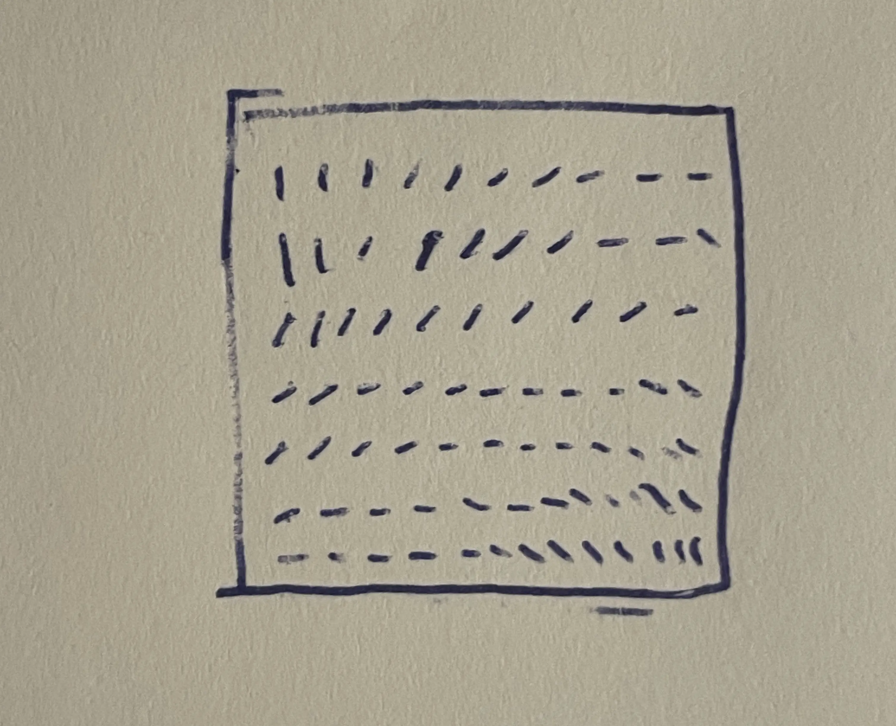
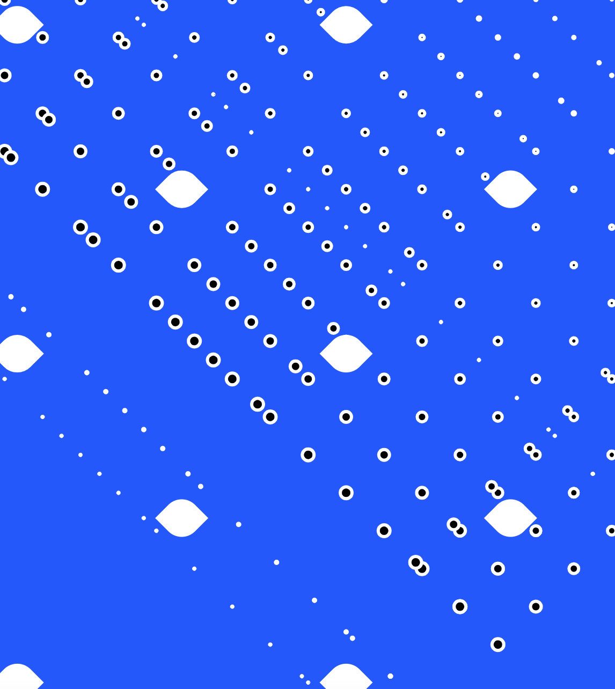
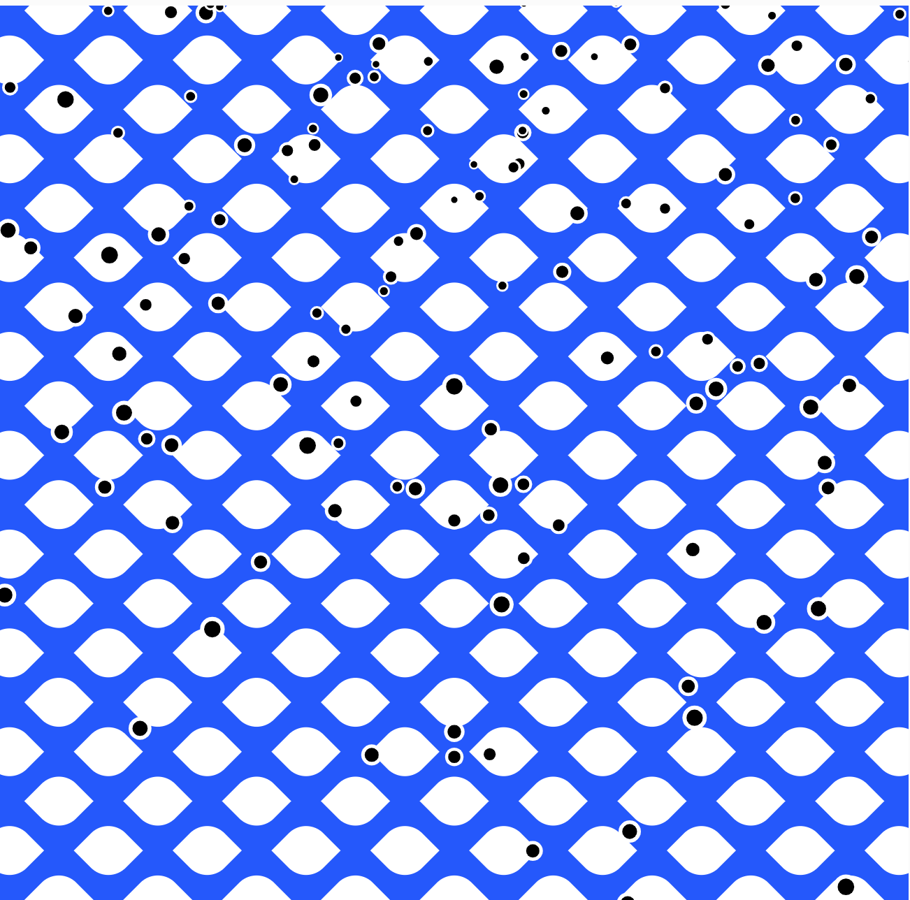
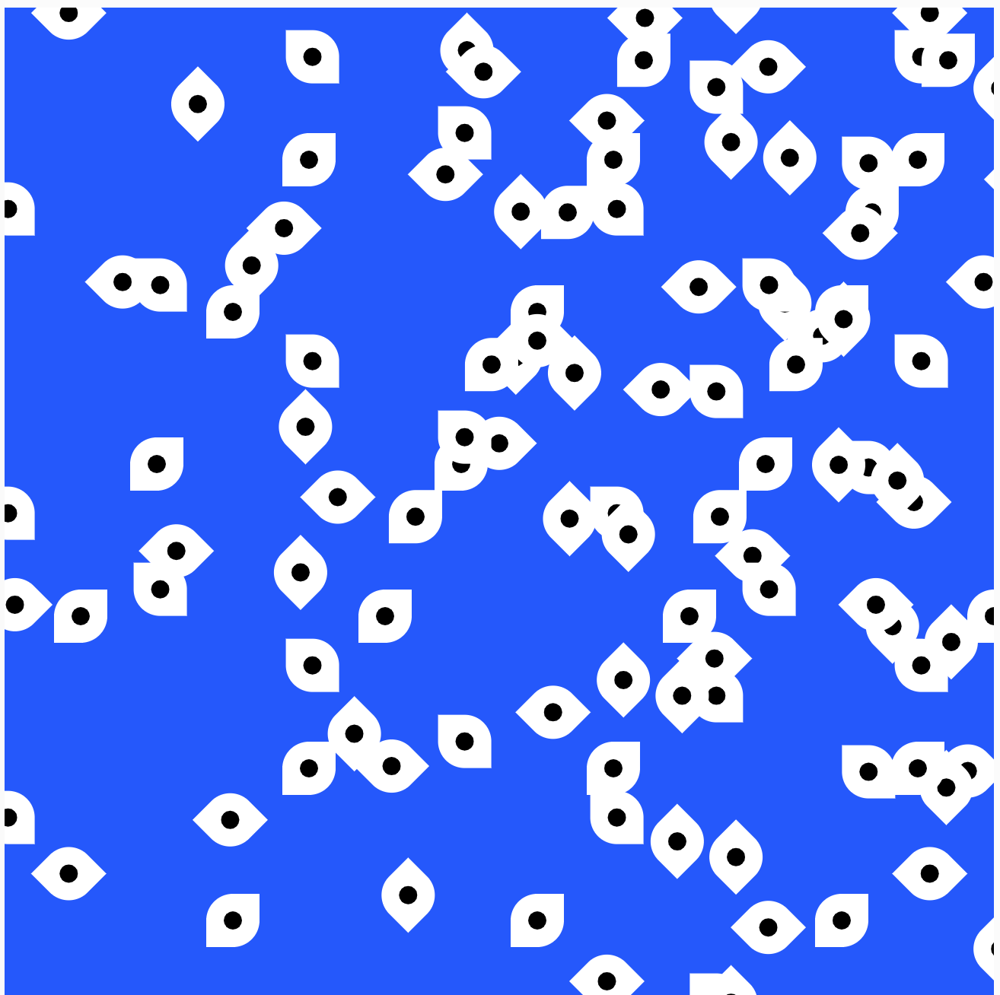

# Day 02

## Iterative Patterns

I started by creating lines, but somehow my idea shifted to eyes.

 

I experimented a lot but encountered problems with the rotation.
Here are some nice failures:

 
 
  

### A variation as a GIF:

### The end result:


<iframe src="https://editor.p5js.org/PerlaH/full/vMejYwLEw" width="100%" height="450" frameborder="no"></iframe>


## End Feelings of the Day:

I had some difficulties creating the initial idea, but I'm very happy with how it turned out in the end.
