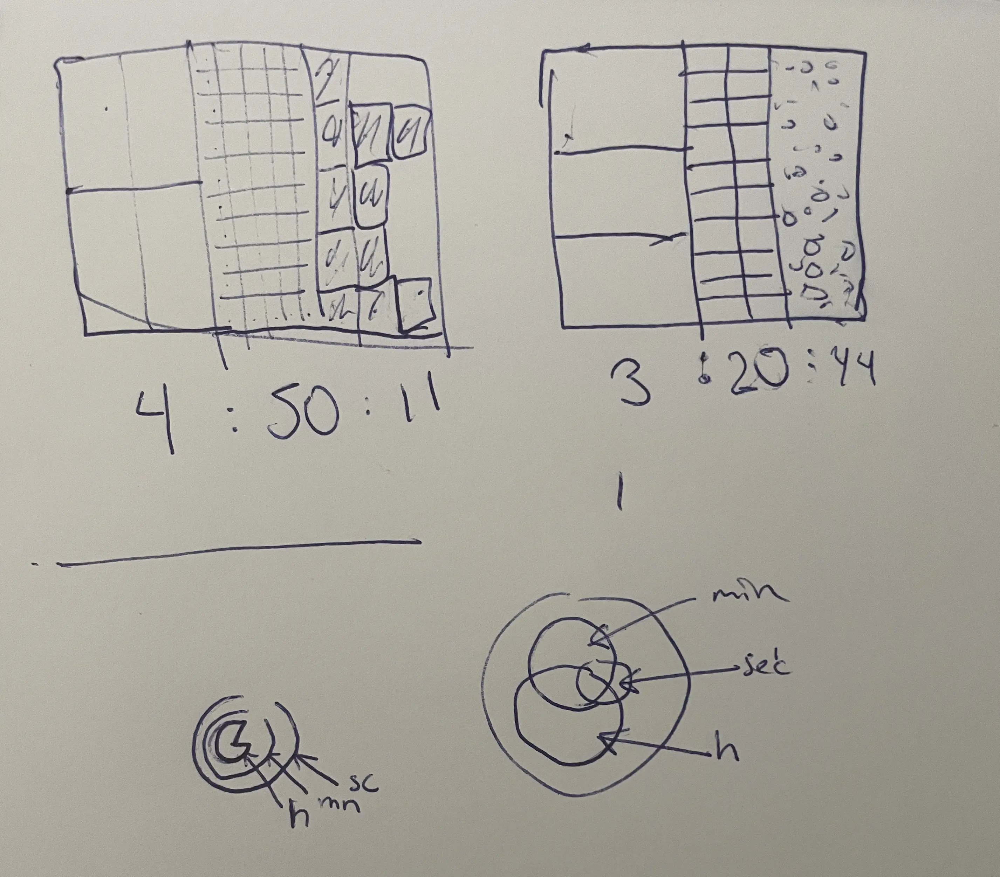
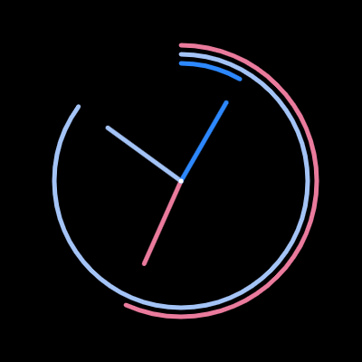
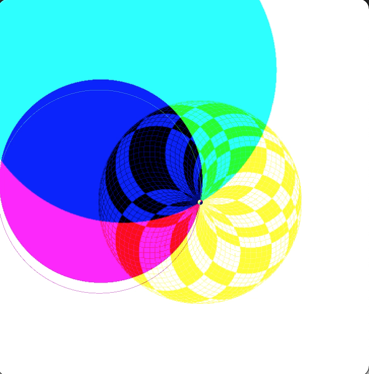
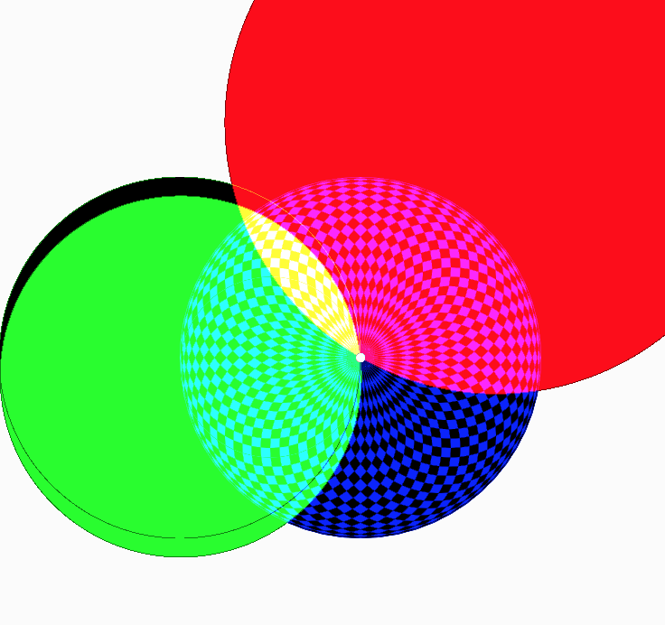

# Day 03

## Clock

Today, I Created My First Clock with Code.
I began by sketching my ideas on paper and then watched a tutorial on how to use clock functions.




My first clock turned out to be a bit plain but colorful. I played with the blend mode, which created some interesting glitches:




The end result of the Clock is:


<iframe src="https://editor.p5js.org/PerlaH/full/mZvKfVr7a" width="100%" height="440" frameborder="no"></iframe>


```js
  //minuten
  let minAngle = map(mn, 0, 60, 0, 360);

  push();
  blendMode(SCREEN);
  fill(0, 255, 0);
  
  rotate(minAngle - 90);
  translate(0, 100);
  circle(0, 0, 200);
  pop();
```

## Problems and Ideas to Work On:

I believe my clock-box idea has potential. I initially started with the code, but it doesn't currently perform a specific rational function. Nonetheless, I may choose to continue working on it.


<iframe src="https://editor.p5js.org/PerlaH/full/pa41T2aCg" width="100%" height="500" frameborder="no"></iframe>
