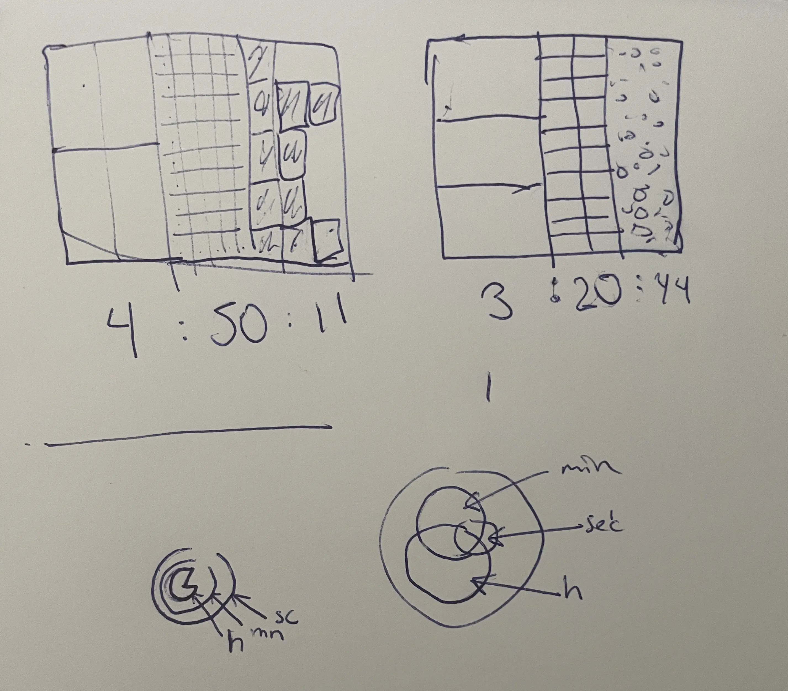
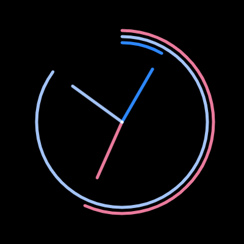
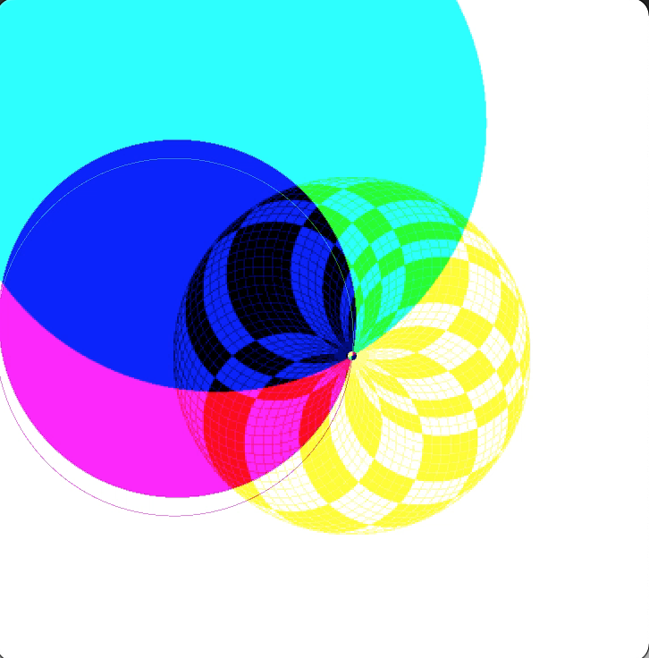
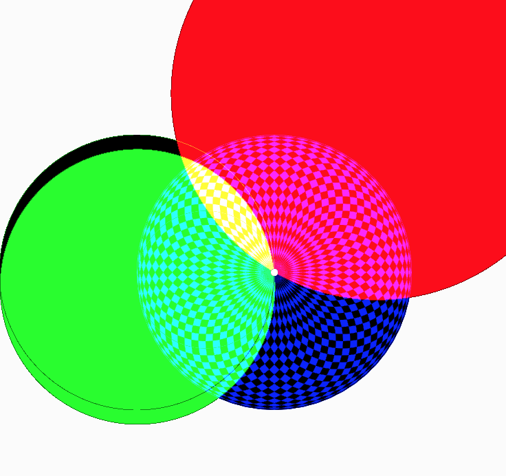

# Day 04

## Clock

Today, I Created My First Clock with Code.
I began by sketching my ideas on paper and then watched a tutorial on how to use clock functions.

My first clock turned out to be a bit plain but colorful. I played with the blend mode, which created some interesting glitches:

The end result of this clock is:


<iframe src="https://editor.p5js.org/PerlaH/full/O8TLv4zP5" width="100%" height="600" frameborder="no"></iframe>


## End Feelings of the Day:

Today didn't go as smoothly as I'd hoped. I attempted to code my sketch, but I wasn't entirely sure where to start, and I ended up wasting a lot of time.
