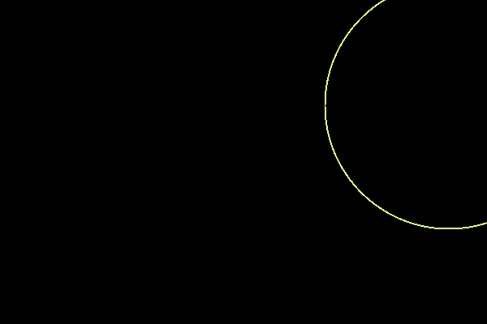

# Day 04

## Drawing Machines

Today's challenge was to create a drawing machine. Initially, I interpreted it as a code-based paint tool where we could draw with the mouse or something similar. However, I soon realized that the concept of a drawing machine went beyond a simple "paint function."

So, I attempted to create abstract random figures so that each time it would change its form.


<iframe src="https://editor.p5js.org/PerlaH/full/HATxzNqNq" width="100%" height="600" frameborder="no"></iframe>



<iframe src="https://editor.p5js.org/PerlaH/full/o3znRtW9B" width="100%" height="600" frameborder="no"></iframe>



<iframe src="https://editor.p5js.org/PerlaH/full/O8TLv4zP5" width="100%" height="600" frameborder="no"></iframe>


## End Feelings of the Day:
In the end, I think I mixed the initial concept with the task at hand.
