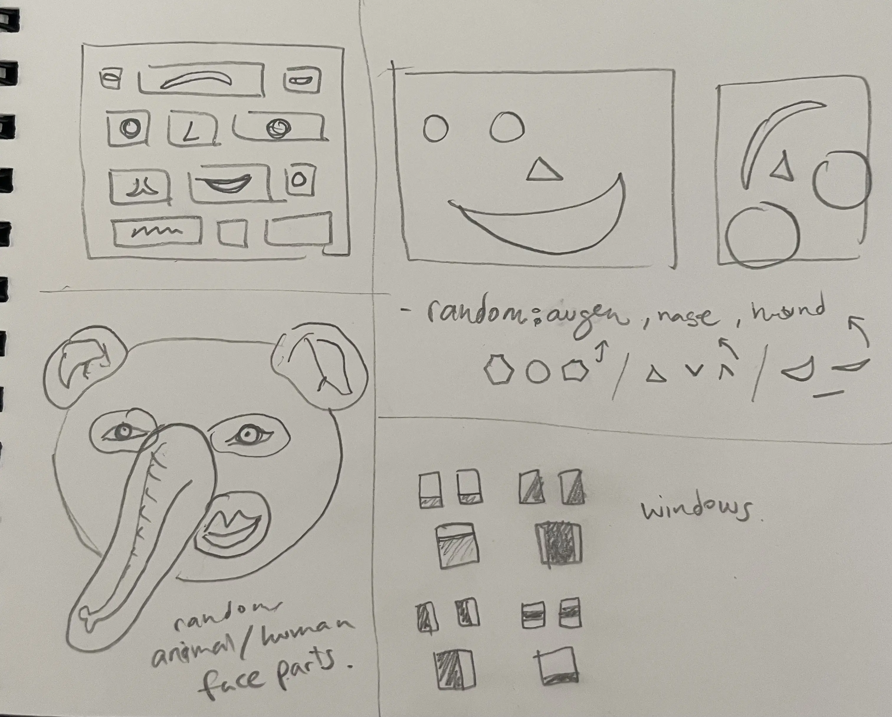
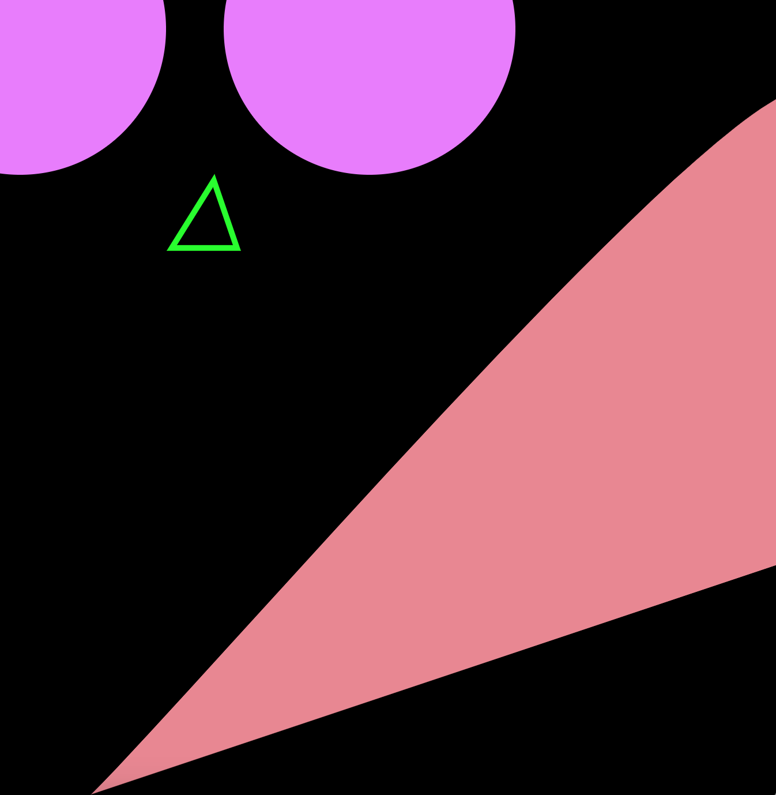
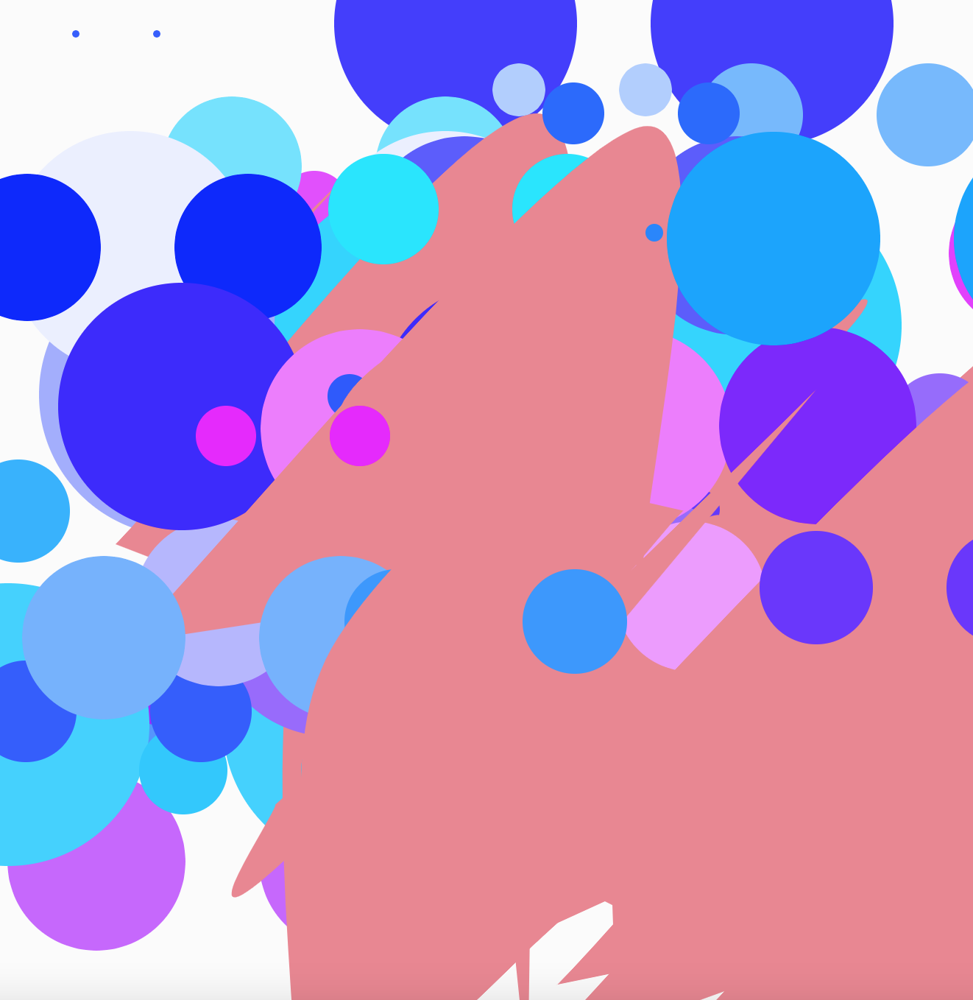
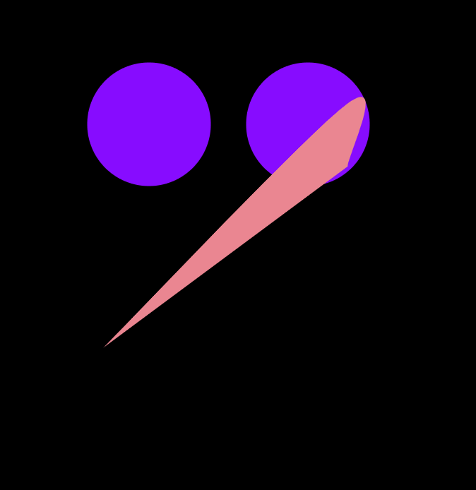
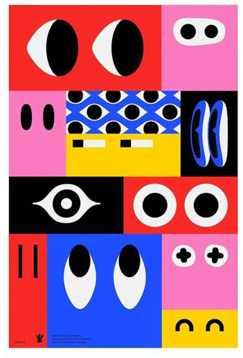
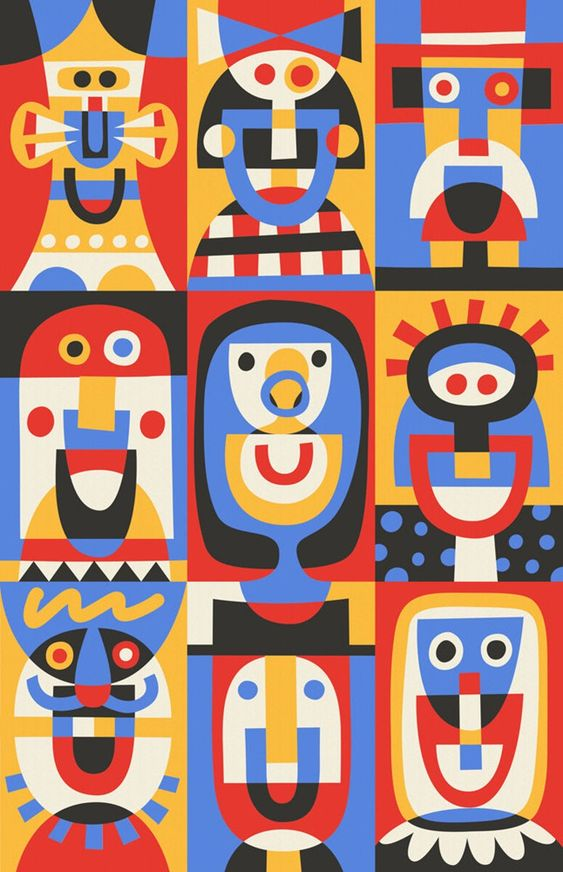
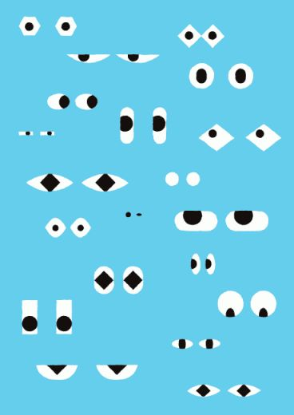

# Day 06

## Faces

To create faces, I had to specify what constitutes a face. I asked myself questions like, "Is a nose really important for something to be interpreted as a face?" and "How different can faces be?"

First, the pen sketches:



I began with some experiments, and this is what I came up with:





I created two functions for the eyes, mouth, and nose, then placed them randomly. I noticed that the nose could also serve as the mouth and that the actual mouth wasn't quite satisfactory. That's why I erased it in the final sketch:

```js
function draw() {
  background(0);

  let posX = int(random(windowWidth - 100));
  let posY = int(random(windowHeight - 100));
  
  let posX2 = int(random(windowWidth * 0.5));
  let posY2 = int(random(windowHeight * 0.5));
 /* mund(posX2, posY2);*/

  auge(posX, posY);
  nase(posX2 + 100, posY2 + 100);
}
```


<iframe src="https://editor.p5js.org/PerlaH/full/f2K9_Qu1d" 
width="100%" height="750" frameborder="no"></iframe>


I wasn't satisfied with the result, so I looked for more inspiration:





Similar to the first experiment, I created functions for the eyes and then placed them within a loop function to randomly select them.

```js
function draw() {
  background(220);

  let picker = random(1);
  if (picker > 0.8) {
    aug1();
  } else if (picker > 0.5) {
    aug2();
  } else if (picker > 0.2) {
    aug3(width / 2, height / 2);
  } else {
    circle(width / 2 - 25, height / 2, 30);
    circle(width / 2 + 25, height / 2, 30);
  }
}
```


<iframe src="https://editor.p5js.org/PerlaH/full/VZZgNxfN7"
width="100%" height="500" frameborder="no"></iframe>


## Problems and Ideas to Work On:
The last sketch is not finished yet, but I look forward to completing it.