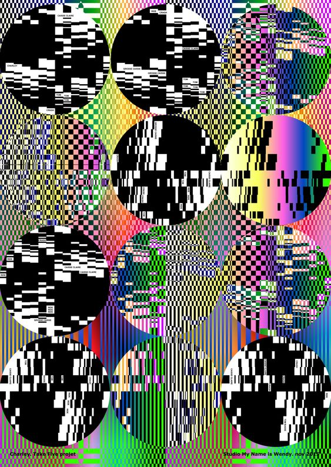

# Day 07

## Pixels

Today, we had to experiment with pixels. I learned how to upload an image and manipulate it.

For the first sketch, I mapped the RGB values of the pixels using the mouseX and mouseY coordinates. This allowed the background to display the color of the pixel from the image.

```js
function draw() {
  let c;

  // get color of middle pixel
  c = img.get(
    map(mouseX, 0, width / 2, 0, img.width),
    map(mouseY, 0, height / 2, 0, img.height)
  );

  background(c[0], c[1], c[2]);
  image(img, 0, 0, width / 2, height / 2);
}
```



<iframe src="https://editor.p5js.org/PerlaH/full/7fHhpQjoN" 
width="100%" height="750" frameborder="no"></iframe>


In the subsequent experiments, I moved pixels with the mouse, altering their color and shape.



<iframe src="https://editor.p5js.org/PerlaH/full/69Fuaf7D_"
width="100%" height="750" frameborder="no"></iframe>


## Problems and Ideas to Work On:
I would like to continue experimenting with pixels in this direction, aiming for more color and graphics:



