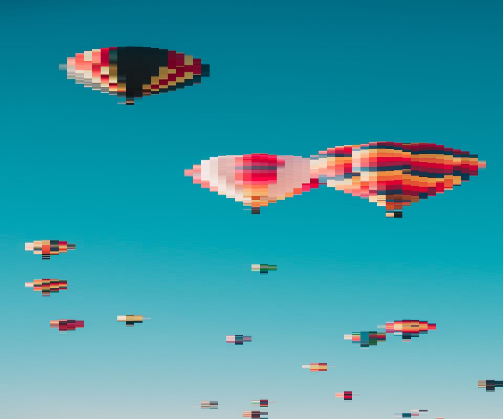
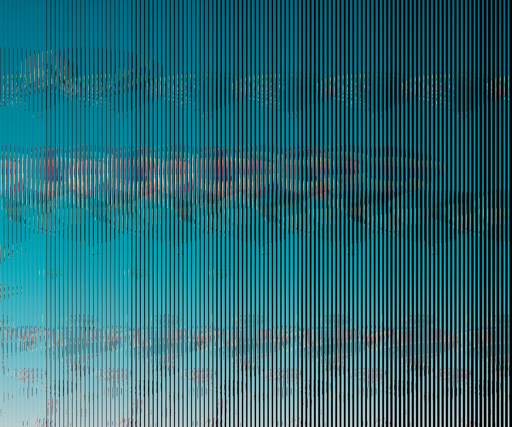
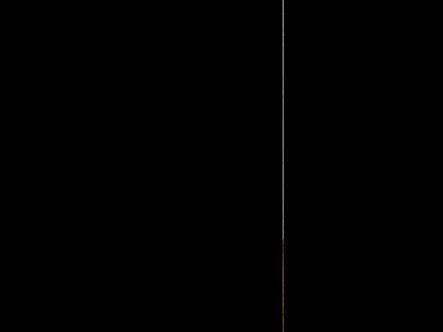
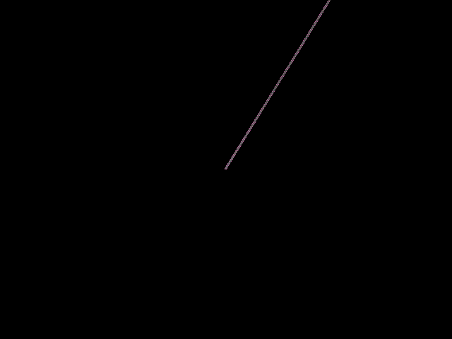
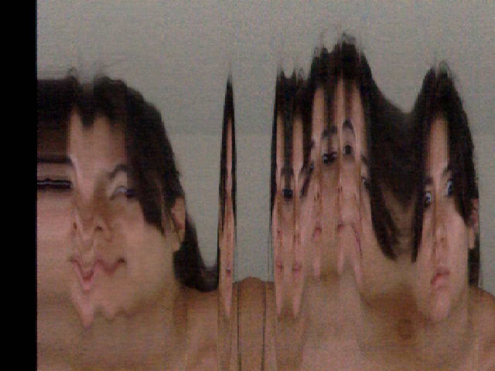
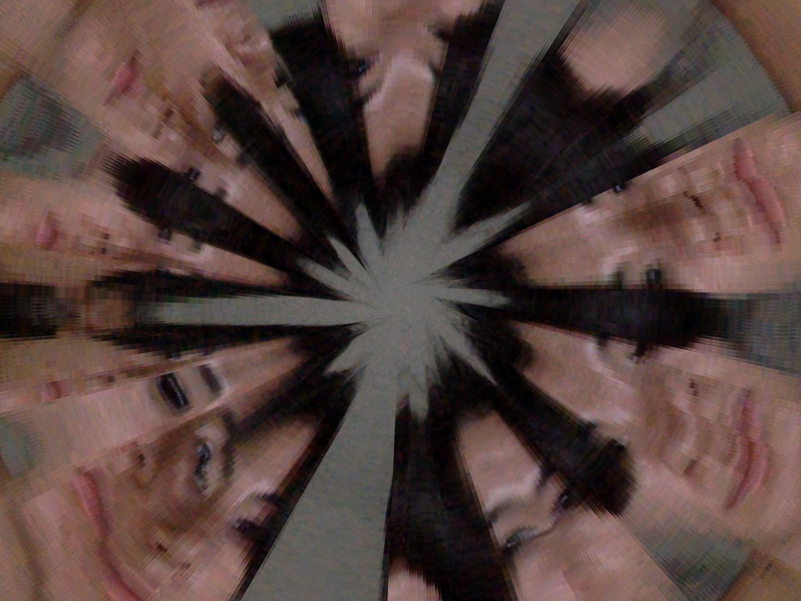

# Day 08

## Pixels Part 2

We continued experimenting with pixels, with today's focus on slitscan.

I began by moving simple pixels using the "copy" function:




Then I moved the image and the strings.

```js
for (var x = 0; x < width; x += w) {

    let factor = map(x,0,width,0.1,2) // unterschiedliche geschwindigkeit der secciosn
    
    let offset = int(map(sin(angle*factor), -1, 1, 0, columns));//moves back and forward
    
    let sx = (x + offset * w) % width;
    copy(img, sx, 0, w, height, x, 0, w, height);
    stroke(0);
    noFill();
  }
  angle += 0.1;
```



<iframe src="https://editor.p5js.org/PerlaH/full/PjdG8fxXN"
width="100%" height="750" frameborder="no"></iframe>


I also experimented with the camera for the first time.








<iframe src="https://editor.p5js.org/PerlaH/full/UYWF7qmsK" 
width="100%" height="480" frameborder="no"></iframe>
