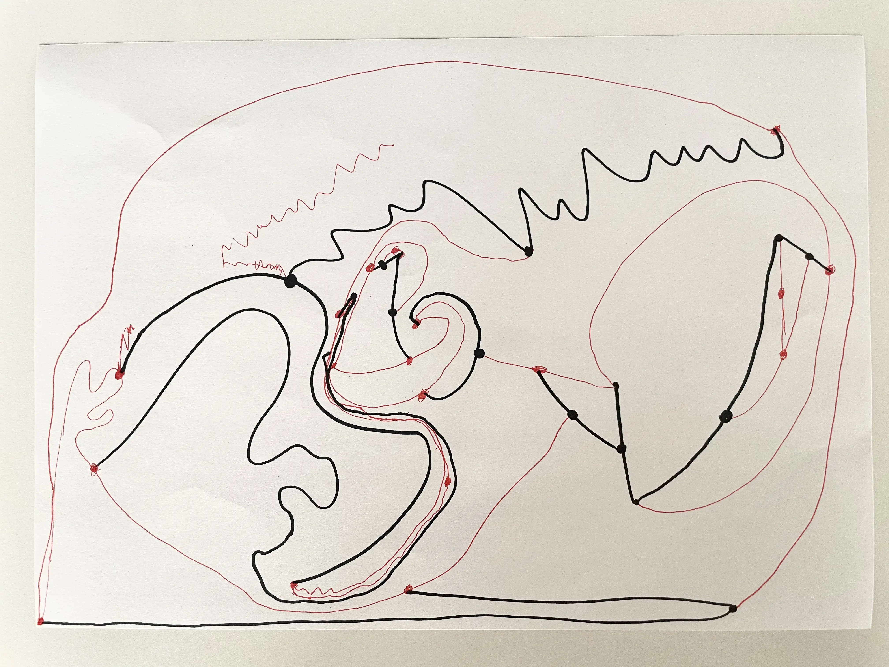
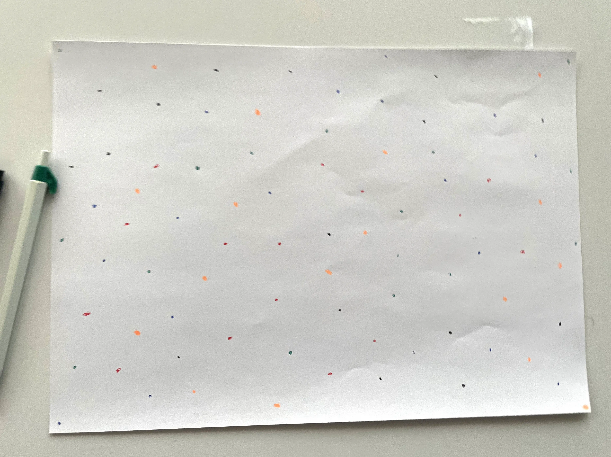
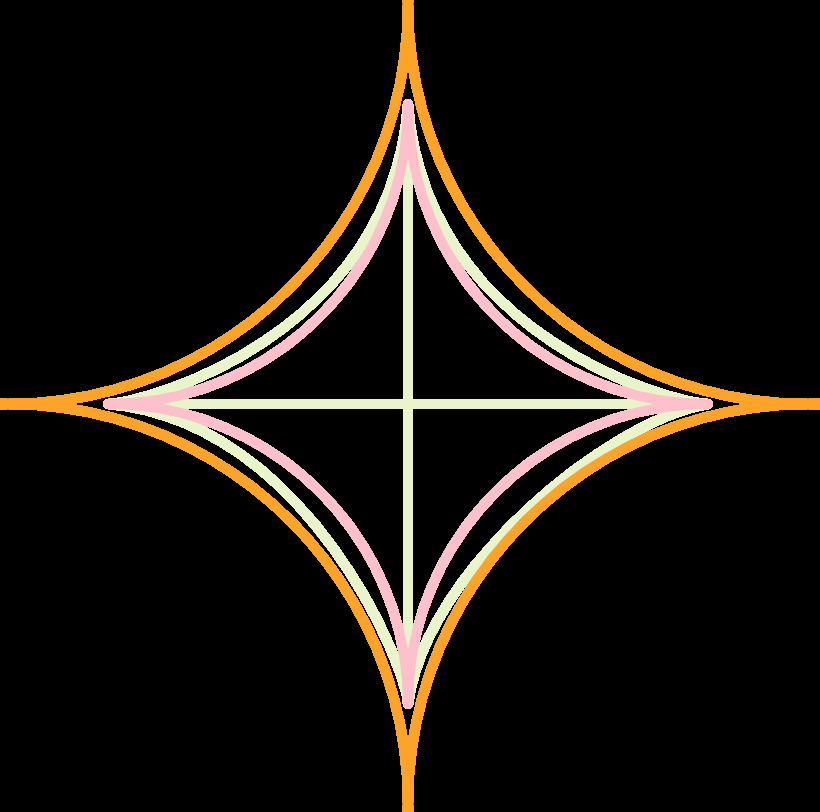
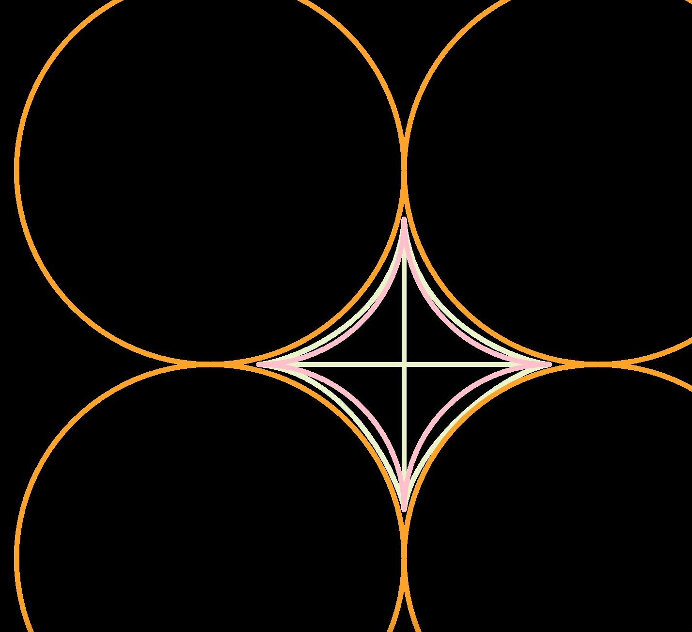
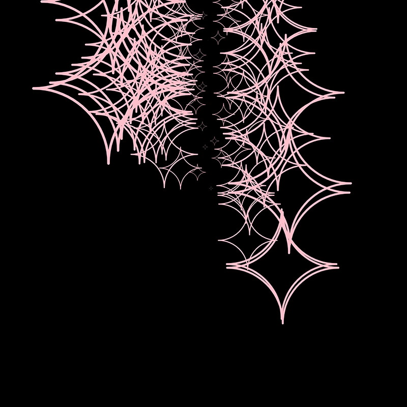
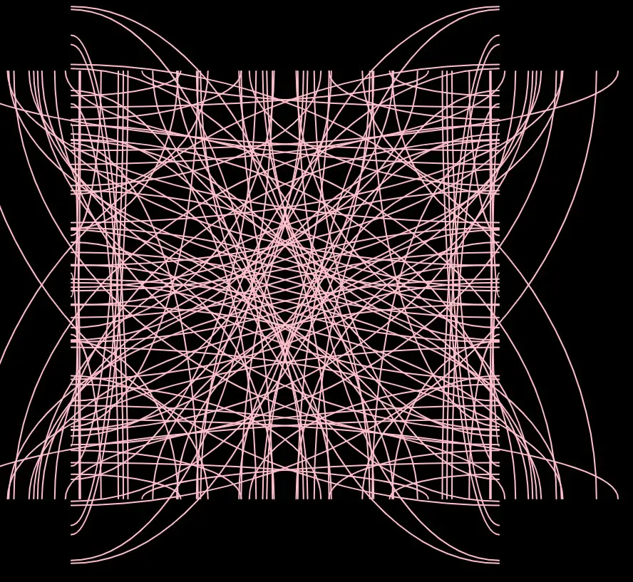
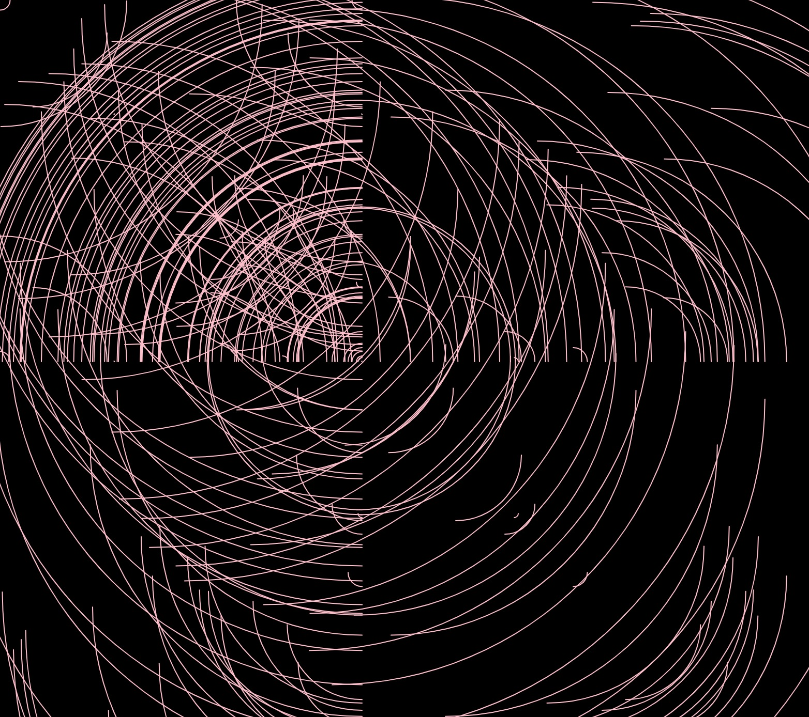

# Day 01

## Computing without computer

### Solid Paper Experiment

We began experimenting in a group with some pens and paper. First, Robin and I played Sprouts. We added an extra rule, allowing players to reuse free points from the old sprout on the paper, creating a huge abstract drawing that resembled a head:

 

In the group, we played "The Beach" for 30 minutes, and this was the result:

 

*A colorful dot paper*

## Computing with computer

### Draw, then Code

I had used p5.js before, so I just had to get into it. I wanted to create a star with the Bezier (and help lines), circles, and finally, the arc functions.

  
 

Then, I wanted to animate it and create a sky full of pink stars with random positions. I could experiment a lot, and it was a good exercise to remember how to use p5.js.

Nice Fails:

To interact with my final artwork, you have to click on it. If you think there are enough stars, press the "n" key, and to save a picture, press "s."


<iframe src="https://editor.p5js.org/PerlaH/full/y8b-ywLwn" width="100%" height="450" frameborder="no"></iframe>


## Problems and Ideas to Work On:

The exercise "The Beach" inspired me to add more interactivity to this sketch. If the viewer thinks there are enough empty stars, they can try to fill the empty spaces by clicking on them and creating a filled star. I need more time to create the "stamp" function; that's why it's not available yet. :/